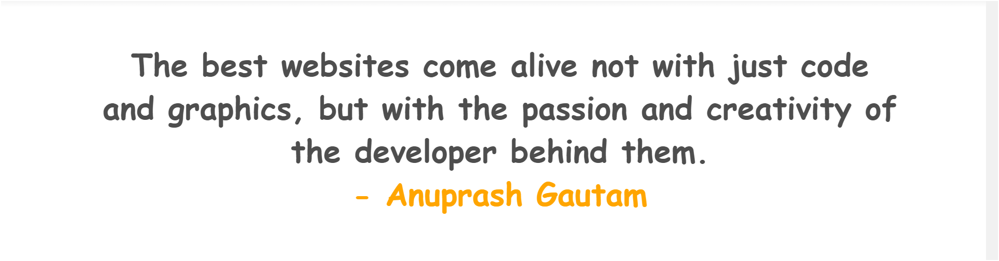

# Hey there! 👋 I am Anuprash Gautam

Welcome to my corner of GitHub where I explore the realms of Artificial Intelligence, Machine Learning, and Web Development! 🚀

## Skills & Tools 🛠️

## About Me ℹ️

- 🎓 I'm a college student majoring in Computer Science & Engineering with a focus on Artificial Intelligence.
- 💡 Passionate about leveraging AI to solve real-world problems and exploring the endless possibilities of machine learning.
- 📱 Love diving into web development, creating interfaces that solve problems and enhance user experiences.

## What You'll Find Here 📚

### Projects
- 🤖 **Artificial Intelligence**: Projects exploring various AI concepts, from natural language processing to computer vision.
- 🧠 **Machine Learning**: Implementations of machine learning algorithms and models for different applications.
- 📱 **Web Development**: Websites built for different platforms, showcasing diverse functionalities.

### Tutorials & Resources
- 📝 I'll be sharing guides, tutorials, and resources on AI, ML, and Web Development to help others learn and grow.

## Getting Started 🛠️

Feel free to explore the folders and projects in this repository. Each project might have its own README with detailed instructions on how to use or contribute.

### Prerequisites
- Basic understanding of programming concepts and the respective domains.

### How to Contribute 🤝
- 👩‍💻 Contributions are welcome! Whether it's bug fixes, enhancements, or new project ideas, feel free to open issues or pull requests.

## Let's Connect! 🌐

I'm always eager to connect with fellow developers and enthusiasts. Feel free to reach out:

- 📧 Email: anuprashgautam@hotmail.com
- 💼 LinkedIn: [Anuprash Gautam](https://www.linkedin.com/in/anuprashgautam/)

## Acknowledgements 🙏

A big thanks to the open-source community for the inspiration and continuous learning opportunities.

Looking forward to learning and building amazing things together! 🌟
