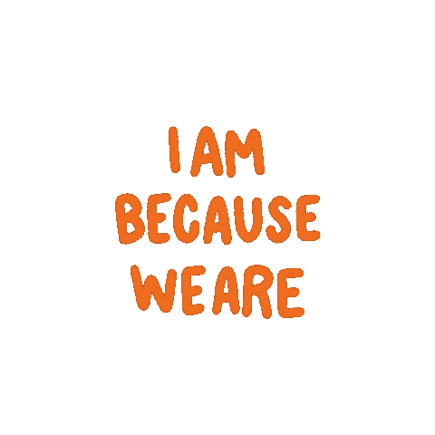

#  &nbsp; Anuprash Gautam &nbsp; 

    

 

<!--- ------------------------------------------------------------------------------------------------------------------------------------------------------ -->
<!--- -- Who am I? ----------------------------------------------------------------------------------------------------------------------------------------- -->
<!--- ------------------------------------------------------------------------------------------------------------------------------------------------------ -->

## Who am I? 

I'm **Anuprash Gautam**, currently pursuing my Bachelor of Technology in Computer Science and Engineering with a specialization in _**Artificial Intelligence**_ from a college in India.

- 🎓 I'm passionate about learning the core concepts of _**Java Development**_ and _**Artificial Intelligence**_.
- 💻 I actively contribute to open-source projects and believe in the power of collaborative coding.
- 🌱 I'm dedicated to pushing my work regularly to maintain an organized coding environment and continuously improve my skills.

Outside of coding, I enjoy exploring new technologies, reading tech blogs, and occasionally diving into travelling.🧳

 

<!--- ------------------------------------------------------------------------------------------------------------------------------------------------------ -->
<!--- -- Education ----------------------------------------------------------------------------------------------------------------------------------------- -->
<!--- ------------------------------------------------------------------------------------------------------------------------------------------------------ -->

## Education 

- **Bachelor of Technology in Computer Science and Engineering (AI)**
  - [Meerut Institute of Engineering and Technology](https://miet.ac.in/)
  - Currently pursuing

- **Senior Secondary (Class 12th)**
  - Computer Science with Python
  - Board: CBSE
  - Percentage: 83%

- **Secondary (Class 10th)**
  - Board: CBSE
  - Percentage: 88%

 

<!--- ------------------------------------------------------------------------------------------------------------------------------------------------------ -->
<!--- -- Skills -------------------------------------------------------------------------------------------------------------------------------------------- -->
<!--- ------------------------------------------------------------------------------------------------------------------------------------------------------ -->

## Skills 

<!--  -->

<!--  -->
<!--  -->

<!--  -->
<!--  -->

 

<!--- ------------------------------------------------------------------------------------------------------------------------------------------------------ -->
<!--- -- Projects ------------------------------------------------------------------------------------------------------------------------------------------ -->
<!--- ------------------------------------------------------------------------------------------------------------------------------------------------------ -->

## Projects 

| Projects | Deployed Link | Repository | Tech Stack & Tools |
|:---------|:-------------:|:----------:|:-------------------|
| Weather App | [view](https://weather-application-nu-lemon.vercel.app/) | [repo](https://github.com/AnuprashGautam/Weather-Application) | `HTML` `CSS` `Node.js` `JavaScript` `React` `Postman` | 
| EnRgy | - | [repo](https://github.com/AnuprashGautam/Project-EnRgy) | `HTML` `CSS` `JavaScript`| 
| Portfolio | - | [repo](https://github.com/AnuprashGautam/Portfolio) | `HTML` `CSS` `Node.js` `React` | 

 

<!--- ------------------------------------------------------------------------------------------------------------------------------------------------------ -->
<!--- -- Let's Connect! ------------------------------------------------------------------------------------------------------------------------------------ -->
<!--- ------------------------------------------------------------------------------------------------------------------------------------------------------ -->

## Let's Connect! 

I love connecting with different people so if you want to say hi, I'll be happy to meet you more! 😊

<!--  -->

<!--  -->

 

<!--- ------------------------------------------------------------------------------------------------------------------------------------------------------ -->
<!--- -- Statistics ------------------------------------------------------------------------------------------------------------------------------------------ -->
<!--- ------------------------------------------------------------------------------------------------------------------------------------------------------ -->

## Statistics 

  

  

  

<!--  -->
